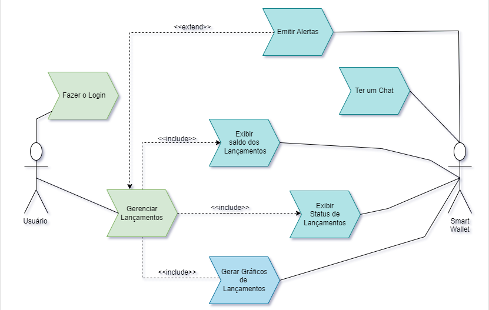

# Especificações do Projeto

Pré-requisitos: <a href="1-Documentação de Contexto.md"> Documentação de Contexto</a>

Para direcionar melhor a aplicação proposta, precisamos entender quais faixas etárias compreendem os maiores endividados do pais, segundo dados do Serasa[1], a faixa de pessoas entre os 26 e 40 anos, representa a maioria dos endividados correspondendo a 34,8% sendo seguida de perto pela faixa de 41 a 60 anos que compreende 34,7% da população, em pesquisa realizada em Janeiro de 2023.

A aplicação é destinada a qualquer pessoa que busque uma melhor organização de suas finanças, mas estas faixas citadas a cima, serão o foco da solução e de sua divulgação.

## Personas

As personas levantadas durante o processo de entendimento do problema são apresentadas a seguir:

`Lucas Vieira` é um advogado trabalhista com 5 anos de experiência, atuando em processos judiciais, promovendo defesas de empresas e de clientes em ações trabalhistas. Armando tem grande dificuldade de organizar suas finanças pois ele atende muitos clientes simultaneamente e com varios clientes que necessitam ser cobrados em datas especificas, com este situação ele esta acabando se atrapalhando em fazer as cobraças e administrar suas contas em geral(despesas, ganhos).

`Mateus Rodrigues` é um jovem de 22 anos, recentemente formado como Desenvolvedor e Analista de Sistemas, trabalhando como Desenvolvedor Web Front-End na HP Brasil. Demonstra ter um problema grave de disciplina e organização quando o assunto é Finanças, não tendo controle nenhum sobre seus gastos, fazendo com que ele não consiga criar suas reservas financeiras para seu próprio futuro e para ajudar sua família.

`Daniel Lima` tem 25 anos e está cursando Economia na UFMG. Tem um filho de 5 anos do último relacionamento e paga pensão para a criança. Faz estágio remunerado na área de formação, com rendimento em torno de R$1.572,00. Apesar de estar cursando Economia, não tem conseguido gerir bem as suas finanças para conseguir pagar as suas despesas sem se endividar com empréstimos e cartões de crédito.

`Fernando Andrade` tem 43 anos, mora no interior de Minas Gerais, é criador de gado e tem um casal de filhos gêmeos que entraram recentemente em uma faculdade particular do Rio de Janeiro. Pelo alto valor das mensalidades dos cursos, os gastos mensais do mesmo aumentaram consideravelmente, e por isso ele está com problemas em se organizar financeiramente.No seu tempo livre, gosta de participar de competições de tiro ao alvo.

`Helena Gonçalves` tem 29 anos, estudante universitária, tem dois gatos, namora, mora sozinha, sua renda é de aproximadamente R$5000,00. Nas horas vagas adora assistir séries e uma ou duas vezes por mês se reunir com os amigos. Como mora sozinha e tem muitas contas a serem pagas, fica perdida no que foi pago e no que é preciso pagar, já tentou planilha, anotar em papel mas sempre perde a paciencia de ter que preencher mês a mês.

`Ricardo Machado` tem 39 anos, agricultor, trabalhador do campo, uma pessoa que vive da terra e seus plantios. Tem dificuldades para gerir suas finanças e vive recorrendo a empréstimos para sanar suas despesas e poder manter suas contas em dia. Não tem reservas e tem grandes problemas em suas lavouras devido ao fato de não ter capital de giro para subsidiar seu manejo.

## Histórias de Usuários

Com base na análise das personas forma identificadas as seguintes histórias de usuários:

|EU COMO... `PERSONA`| QUERO/PRECISO ... `FUNCIONALIDADE` |PARA ... `MOTIVO/VALOR`  |
|--------------------|------------------------------------|-------------------|
| Lucas Vieira | Conseguir preencher uma descrição para cada transação realizada | Para saber qual foi o motivo da transação em questão |
| Lucas Vieira | Administrar meus lançamentos | Gerir de forma direta todas as movimentações financeiras realizadas                     |
| Matheus Rodrigues | Acompanhar o saldo total a minha receita  | Saber o valor que ainda tenho disponível em tempo real              |
| Daniel Lima | Receber um aviso quando meus gastos atingirem alta porcentagem em relação à minha receita | Controlar melhor minha despesas                          |
| Fernando Andrade           | Visualizar de forma geral meus gastos x despesas | Acompanhar meu fluxo de transações        |
| Fernando Andrade            | Acessar de forma rápida minhas receitas bancárias em apenas um lugar | Ter maior controle da minha quantida total disponível todas as minhas contas bancárias                            |
| Helena Gonçalves           | Cadastras minhas contas fixas mensais com as respectivas datas de vencimento  | Evitar a cobrança de juros gerada por falta de pagamento na data correta         |
| Ricardo Machado                | Visualizar de forma fácil e evidente meus lançamentos efetivados e/ou pendentes | Ter maior controle da conta que  que já está paga e da que ainda está em aberto        |
| Ricardo Machado            | Ter a opção de exibir ou não o valor total da receita | Ter mais privacidade sobre meus dados financeiros ao abrir o aplicativo            | 

## Modelagem do Processo de Negócio 

### Análise da Situação Atual

Muitas pessoas têm enormes dificuldades em acompanhar suas receitas e despesas, falta de conhecimento sobre finanças e falta de motivação para se manter disciplinado, a gestão das finanças pessoais é um desafio muito importante na vida de todos, uma gestão inassertiva pode acarretar consequências negativas, como endividamento, falta de planejamento e insegurança financeira.

A portabilidade, facilidade de uso e o amplo uso de celulares em todo o mundo, amplia o leque de possibilidades para suprir as demandas dos usuários em relação ao controle de suas finanças.

### Descrição Geral da Proposta

O aplicativo de finanças pessoais proposto neste projeto busca solucionar os problemas descritos acima, oferecendo uma aplicação:
 - De fácil usabilidade
 - Simples e intuitivo, facilitando o uso por pessoas de todos os níveis de conhecimento.
 - Atualizado, com novas funcionalidades e recursos constantemente.

O aplicativo contará com as seguintes funcionalidades:
  - Rastreamento de receitas e despesas, permitindo que os usuários registrem todas as suas receitas e despesas.
  - Análise de gastos, fornecendo relatórios e gráficos que ajudam os usuários a entenderem seus hábitos de consumo.
  - Planejamento financeiro, permitindo que os usuários criem metas financeiras e acompanhem seu progresso.

O aplicativo objetiva proporcionar uma considerável melhoria da gestão financeira pessoal de seus usuários, ajudando-os a controlarem seus gastos, planejar suas metas financeiras e alcançar seus objetivos.

## Fluxo Global da Aplicação

*Os processos destacados em vermelho na imagem acima, são detalhados abaixo:

<b>Processo 1</b>: Etapa onde verifica-se se o usuário já é cadastrado no sistema
 
<b>Processo 2</b>: Se o usuário não é cadastrado, aplicação abrirá uma tela para que o usuário preencha seu Nome completo, e-mail e a senha desejada

<b>Processo 3</b>: Se o usuário é cadastrado, ele deverá digitará seu e-mail e senha e caso estejam corretos, após validação, terá acesso a aplicação

<b>Processo 4</b>: Após o login, o usuário é direcionado para sua página inicial, onde poderá ver as suas informações cadastradas. O usuário também poderá nesta seção, acessar relatórios, gerenciar o seu perfil.

<b>Processo 5</b>: Após o acesso, quando desejar efetuar um lançamento, ele escolherá o opção de Lançar uma transação, A tela da escolha da transação, fará com que o usuário escolha se o lançamento deverá ser de uma Receita ou Despesas

<b>Processo 6</b>: Caso o lançamento escolhido seja de uma Receita, o usuário deverá escolher a:
 - Classificação: Salário, Rendimentos, Extras, Diversos
 - Data de Vencimento
 - Recorrente: Caso o lançamento seja de uma receita que ocorra mais de uma vez
 - Valor
 - Status: Efetivado ou Pendente
 - Descrição: um breve relato do que se refere aquele lançamento

<b>Processo 7</b>: Caso o lançamento escolhido seja de uma Despesa, o usuário deverá escolher a:
- Classificação: Alimentação, Cartão de Crédito, Educação, Empréstimos, Entretenimento, Eventos, Impostos, Imprevistos, Moradia, Saúde, Seguros, Taxas, Transporte, Veículo, Vestuário e Outros
- Data de Vencimento
- Recorrente: Caso o lançamento seja de uma despesa que ocorra mais de uma vez
- Valor
- Status: Efetivado ou Pendente
- Descrição: um breve relato do que se refere aquele lançamento

<b>Processo 8</b>: Após o lançamento realizado, a aplicação realizará a atualização dos saldos da conta do usuário, sendo possível ele acompanhar suas receitas e despesas com maior assertividade.

## Indicadores de Desempenho

Apresente aqui os principais indicadores de desempenho e algumas metas para o processo. Atenção: as informações necessárias para gerar os indicadores devem estar contempladas no diagrama de classe. Colocar no mínimo 5 indicadores. 

Usar o seguinte modelo: 

Obs.: todas as informações para gerar os indicadores devem estar no diagrama de classe a ser apresentado a posteriori. 

## Requisitos

O escopo funcional do projeto é definido por meio dos requisitos funcionais que descrevem as possibilidades interação dos usuários, bem como os requisitos não funcionais que descrevem os aspectos que o sistema deverá apresentar de maneira geral. Estes requisitos são apresentados a seguir.

### Requisitos Funcionais

|ID    | Descrição do Requisito  | Prioridade |
|------|-----------------------------------------|----|
|RF-001| A aplicação deve permitir o usuário gerenciar seus lançamentos. | ALTA | 
|RF-002| A aplicação deve gerar um saldo pegando o valor das receitas e subtraindo aos das despesas.   | ALTA |
|RF-003| A aplicação deve emitir alertas, quando as despesas atingirem 75% do valor das receitas. | MÉDIA | 
|RF-004| A aplicação deve permitir que o usuário faça login.  | ALTA |
|RF-005| A aplicação deve apresentar um gráfico de receitas versus despesas| MÉDIA | 
|RF-006| A aplicação deve emitir alertas próximo aos vencimentos dos pagamentos cadastrados   | BAIXA |
|RF-007|A aplicação deve ter uma página com a Visão Geral dos Lançamentos(Despesas/Receitas) com Status de Efetivado ou Pendente, identificados com cores. | MÉDIA | 
|RF-008|A aplicação deve ter a funcionalidade de ocultar o saldo  | MÉDIA | 
|RF-009|A aplicação deve ter a funcionalidade de chat  | ALTA | 

### Requisitos não Funcionais

|ID     | Descrição do Requisito  |Prioridade |
|-------|-------------------------|----|
|RNF-001| A aplicação deve ter uma interface de usuário intuitiva e clara | MÉDIA | 
|RNF-002| O sistema deve ser responsivo para rodar em um dispositivos móvel | MÉDIA | 
|RNF-003| A aplicação deve ser fácil de manter e atualizar, documentação clara e acessível para os desenvolvedores.|  ALTA | 

## Restrições

O projeto está restrito pelos itens apresentados na tabela a seguir.

|ID| Restrição                                             | 
|--|-------------------------------------------------------|
|01| O projeto deverá ser entregue até o final do semestre|
|02| O projeto deverá ser executado apenas pelos alunos que compõe o grupo, sem contratação de profissionais     |
|03| A aplicação só estará disponível para dispositivos móveis   |

## Diagrama de Casos de Uso

O diagrama de casos de uso é o próximo passo após a elicitação de requisitos, que utiliza um modelo gráfico e uma tabela com as descrições sucintas dos casos de uso e dos atores. Ele contempla a fronteira do sistema e o detalhamento dos requisitos funcionais com a indicação dos atores, casos de uso e seus relacionamentos. 

# Matriz de Rastreabilidade

A matriz de rastreabilidade apresentada abaixo, contempla todos os elementos relevantes que fazem parte do sistema.

# Gerenciamento de Projeto

A gestão assertiva de um projeto, é parte fundamental para que este alcance resultados positivos ao seu final. Gerenciar um projeto é deter de controle de áreas que são cruciais para estes resultados, tais como: escopo, custos, tempo, qualidade e custos, pois, qualquer alteração em uma dessas áreas, dificilmente não impactará as demais.

Quanto maior for o controle do gestor dos elementos que compõe um projeto, maiores serão suas chances de alcançar os objetivos propostos, vista que, o controle trará respostas mais imediatas aos riscos identificados reduzindo a incidência de problemas. 

## Gerenciamento de Tempo

Todo objetivo é constituído por uma meta que se pretende alcançar, e para tanto, é de extrema importância que se definia quando este evento deve ocorrer, sem que haja um deadline para o alcance de uma meta, esta nunca será de fato alcançado, pois, nunca será priorizada em face do seu limite de tempo para finalização.

https://github.com/orgs/ICEI-PUC-Minas-PMV-ADS/projects/455/views/1

#### As atividades e sua execução, serão acompanhadas através de um kanban contendo todoas as tarefas e seus prazos de início e finalização para uma melhor rastreabilidade da execução
[https://github.com/orgs/ICEI-PUC-Minas-PMV-ADS/projects/455](https://github.com/orgs/ICEI-PUC-Minas-PMV-ADS/projects/455)

## Gerenciamento de Equipe

Projetos entregam resultados, resultados são providos por pessoas, essa relação é algo imutável, pois, é impossível a não incidência de stakeholders no projeto, seja eles diretos ou indiretos. 

Se é necessário ter um assertivo controle no gerenciamento de um projeto para que se obtenha bons resultados ao seu final, o que podemos dizer de uma boa gestão da equipe? Uma equipe de sucesso é composta por profissionais que estão direcionados a obtenção do mesmo objetivo, trabalham focados, envolvendo-se o máximo possível para que ao final, o projeto logre o êxito planejado.

### Descrição da Equipe: 

| # | Função | Nome | 
|-------|---------------------|----|
| 1 | Desenvolvedor Pleno | Leonardo Buck |
| 2 | Desenvolvedor Pleno | Leonardo Lima |
| 3 | Desenvolvedor Sênior | Joe Monteiro de Sousa |
| 4 | Analista de Teste | Thiago Gomes da Silva |
| 5 | Gerente de Projeto | Thaís Cristine Santana Oliveira

### Papéis e responsabilidades

 - <b>Desenvolvedores:</b> executar o escopo elicitado e alvo da solução do projeto. Caberá aos desenvolvedores, as tarefas de criar e corrigir todo o código necessário para que a aplicação proposta funcione corretamente na utilização dos usuários

 - <b>Analista de Teste:</b> realizar todos os testes necessários que atestem a qualidade do código desenvolvido, identificar bugs que devem ser corrigidos e respaldar a solução de possíveis problemas pós a sua entrega

 - <b>Gerente do Projeto:</b> ser o facilitador da equipe, de modo a que todos os impedimentos, problemas e riscos, possam ser mitigados não impactando a qualidade dos entregáveis conforme os requisitos elicitados. 

## Gestão de Orçamento
Projeto tem estimativa de ser realizado durante 5 meses, onde abaixo, temos o descritivo do custo planejado para a execução do projeto contemplando todos os itens necessários para este desenvolvimento.

